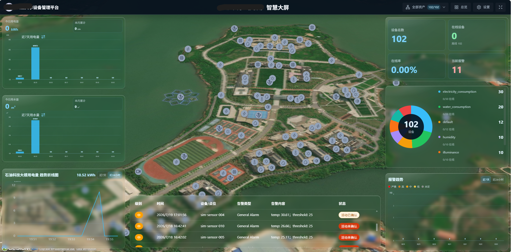
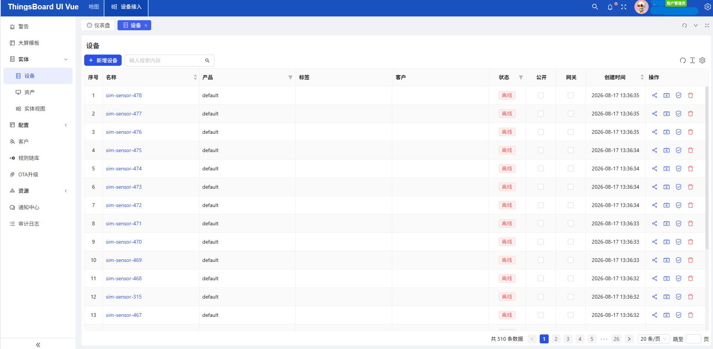
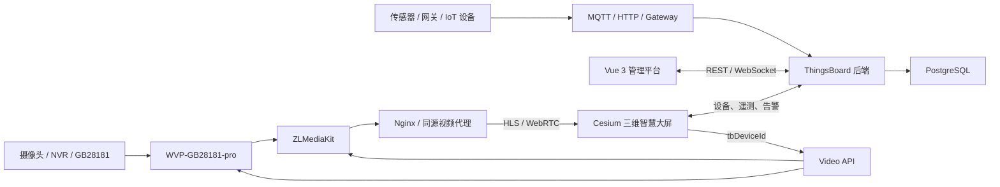
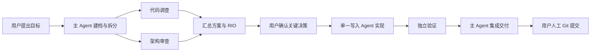

<div align="center">

# ThingsBoard Cesium

### 面向校园、园区与工业物联网场景的三维可视化和智慧大屏平台

基于 ThingsBoard、ThingsBoard UI Vue 3 与 CesiumJS 开发，
将物联网设备管理、实时遥测、告警、资产关系、视频监控与三维空间可视化整合到统一平台。

[](https://github.com/thingsboard/thingsboard)
[](https://vuejs.org/)
[](https://www.typescriptlang.org/)
[](https://github.com/CesiumGS/cesium)
[](https://spring.io/projects/spring-boot)
[](#开源项目与许可证)

</div>

---

## 项目简介

ThingsBoard Cesium 是一个面向校园、园区、楼宇和工业现场的物联网三维可视化平台。

项目在 ThingsBoard 设备管理、遥测、资产、告警和规则引擎能力的基础上，引入 CesiumJS 三维地图，并基于 Vue 3 实现可配置的智慧大屏、传感器点位、视频监控、实时数据部件和资产筛选能力。

项目希望解决传统物联网平台中“设备数据、地理空间、视频监控和运营大屏相互分离”的问题，让管理员能够在统一平台完成设备接入和大屏配置，让普通用户能够通过三维场景直观查看自己权限范围内的设备、传感器、告警和监控点位。

> [!IMPORTANT]
> 本仓库是基于多个开源项目进行的独立二次开发，不是 ThingsBoard、CesiumGS 或 thingsboard-ui-vue3 作者发布的官方产品。

## 项目截图

### Cesium 三维智慧大屏



大屏将传感器、监控点位、设备统计、能耗数据和告警信息叠加到 Cesium 三维场景中，并支持不同屏幕分辨率下的响应式显示。

### ThingsBoard Vue 3 管理平台



租户管理员可以在管理平台中维护设备、资产、客户、告警、规则链和大屏模板，并将对应资源分配给客户用户。

> 截图中的设备、遥测、告警、时间和地图点位可能来自本地模拟或测试环境，不代表真实生产数据。

## 解决的问题

传统物联网项目通常需要分别维护：

- 设备接入和设备生命周期管理平台；
- 二维或三维 GIS 地图；
- 数据统计和运营大屏；
- 视频监控与流媒体系统；
- 客户、租户和设备权限；
- 遥测、告警和设备控制链路。

这些系统如果独立建设，容易出现设备身份不一致、数据重复、权限分散、播放地址混乱和运维成本较高等问题。

本项目通过统一设备身份和业务接口，将这些能力整合为一套完整链路：

```text
设备接入
  → ThingsBoard 设备与资产管理
  → 遥测、属性、告警和规则处理
  → Vue 3 管理平台
  → Cesium 三维点位与智慧大屏
  → 视频监控和设备控制
```

## 主要功能

### 1. 物联网设备管理

基于 ThingsBoard 提供的设备能力，实现：

- 设备新增、编辑、删除和查询；
- 设备配置与 Device Profile 管理；
- 设备属性和实时遥测；
- 设备在线状态；
- 设备与资产关系；
- 设备分配给客户；
- MQTT、HTTP 和 ThingsBoard Gateway 等接入方式；
- 服务端 RPC 和设备控制。

### 2. 资产与客户权限

- 管理资产、设备、客户和客户用户；
- 使用 ThingsBoard 实体关系组织资产层级；
- 将 Dashboard、Asset 和 Device 分配给客户；
- 客户用户仅访问其权限范围内的资源；
- 用户大屏支持按资产筛选传感器和监控点位；
- 支持查询所选资产及其子资产关联的设备；
- 用户资产选择状态相互隔离，不修改管理员保存的大屏模板。

### 3. Cesium 三维地图

- CesiumJS 三维地球和地图场景；
- 传感器点位展示；
- 摄像头和监控点位展示；
- 按设备类型配置点位颜色和图标；
- 点击点位查看实时状态和详细数据；
- 点位与 ThingsBoard Device UUID 绑定；
- 场景视角、模型和地图配置；
- 告警设备地图定位；
- 资产维度点位筛选；
- 点位状态定时刷新。

### 4. 可编辑智慧大屏

租户管理员可以通过可视化编辑页面配置大屏内容：

- 拖拽和调整部件位置；
- 调整部件宽度和高度；
- 保存大屏布局；
- 配置顶部栏标题、Logo 和操作按钮；
- 配置地图场景和初始视角；
- 将大屏模板分配给客户；
- 用户页面同步读取管理员保存的模板；
- 管理员编辑页与用户运行页使用统一布局数据；
- 支持不同分辨率、浏览器缩放和屏幕尺寸。

### 5. 大屏数据部件

当前大屏包含或支持以下类型的可视化部件：

- 设备总数、在线设备数量和在线率；
- 当前告警数量；
- 设备类型环形统计图；
- 今日和本月累计用电量、用水量；
- 近七天用水、用电柱状图；
- 资产遥测 Key 趋势折线图；
- 告警趋势图和实时告警列表；
- 传感器详情弹窗；
- ThingsBoard 数据源和遥测订阅。

### 6. 分辨率自适应

智慧大屏不依赖单一固定分辨率，支持：

- 基于容器尺寸计算布局；
- 用户大屏和管理员编辑页保持一致；
- 部件自动填充可用显示区域；
- 适配 Windows 显示缩放；
- 适配笔记本屏幕和外接显示器；
- Cesium 渲染分辨率动态调整；
- 顶部栏、地图、部件和弹窗统一缩放；
- 兼容历史大屏模板布局。

### 7. 告警与实时状态

- ThingsBoard 告警列表；
- 告警级别和状态展示；
- 告警确认和趋势统计；
- 告警设备地图定位；
- 设备属性和遥测实时订阅；
- 点位在线、离线和告警状态显示；
- 模拟告警脚本和本地验证工具。

### 8. 视频监控

项目提供统一的视频业务接口和地图监控入口：

- 摄像头在 ThingsBoard 中作为 Device 管理；
- 使用 ThingsBoard Device UUID 作为内部身份；
- Cesium 摄像头点位；
- 单摄像头直播和 HLS 视频播放；
- 摄像头在线和视频流状态；
- 视频截图、PTZ 控制；
- 录像查询和回放；
- 播放会话创建和释放；
- WVP-GB28181-pro 与 ZLMediaKit 集成；
- 同源 `/video-stream/` 播放地址；
- 本地虚拟摄像头验证环境。

浏览器不会直接保存或访问 WVP、ZLMediaKit、RTSP 或摄像头凭证。视频访问统一经过项目 Video API 完成权限检查和播放会话管理。

> 当前视频环境主要用于本地集成验证。真实 GB28181 摄像头、多路摄像头并发和生产部署需要根据实际网络、硬件与设备能力继续验证。

### 9. ThingsBoard 管理功能

项目保留和集成了 ThingsBoard Vue 3 管理端的主要功能：

- 租户、客户和用户管理；
- 设备、资产及其配置；
- Dashboard 和实体视图；
- 告警与规则链编辑；
- OTA 升级和通知中心；
- 审计日志；
- 图片、部件、SCADA 符号和 JavaScript 资源库；
- 系统参数配置；
- 中英文界面。

## 系统架构



系统中的职责划分：

| 模块 | 职责 |
| --- | --- |
| ThingsBoard | 设备、资产、客户、权限、属性、遥测、告警、关系和 RPC |
| Vue 3 前端 | 设备管理、业务页面、大屏编辑和运行时交互 |
| CesiumJS | 三维地图、场景、模型和空间点位可视化 |
| Video API | 摄像头权限、绑定、播放会话、截图、录像和 PTZ |
| WVP-GB28181-pro | GB28181 设备、通道和信令管理 |
| ZLMediaKit | 拉流、转协议、HLS、WebRTC、截图和录像 |
| PostgreSQL | ThingsBoard 数据和项目业务数据存储 |

## 技术栈

| 分类 | 技术 |
| --- | --- |
| IoT 平台 | ThingsBoard 4.3.0-RC |
| 后端 | Java 17、Spring、Maven |
| 数据库 | PostgreSQL |
| 前端框架 | Vue 3、TypeScript |
| 构建工具 | Vite 6、pnpm |
| UI 组件 | Ant Design Vue、Element Plus |
| 状态管理 | Pinia |
| 三维地图 | CesiumJS |
| 图表 | ECharts |
| 大屏布局 | GridStack |
| 规则链编辑 | AntV X6 |
| 视频播放 | hls.js |
| 视频平台 | WVP-GB28181-pro、ZLMediaKit |
| 本地环境 | Docker Compose、PowerShell |

具体版本以仓库中的 `backend/pom.xml` 和 `frontend/package.json` 为准。

## 开源项目与许可证

本项目是在以下开源项目基础上进行的二次开发：

| 项目 | 本项目中的用途 | 许可证 |
| --- | --- | --- |
| [ThingsBoard](https://github.com/thingsboard/thingsboard) | IoT 后端、设备管理、遥测、告警、规则引擎和权限体系 | Apache License 2.0 |
| [thingsboard-ui-vue3](https://github.com/oliver225/thingsboard-ui-vue3) | Vue 3 ThingsBoard 管理端基础、设备和业务管理页面 | Apache License 2.0 |
| [CesiumJS](https://github.com/CesiumGS/cesium) | 三维地球、地图、模型和空间可视化 | Apache License 2.0 |

感谢上述项目及其贡献者为开源社区提供的优秀基础能力。

本仓库中的衍生代码和上游代码应继续遵守相应许可证要求。详细许可证内容请查看：

- [`backend/LICENSE`](backend/LICENSE)
- [`frontend/LICENSE`](frontend/LICENSE)
- [ThingsBoard License](https://github.com/thingsboard/thingsboard/blob/master/LICENSE)
- [thingsboard-ui-vue3 License](https://github.com/oliver225/thingsboard-ui-vue3/blob/master/LICENSE)
- [CesiumJS License](https://github.com/CesiumGS/cesium/blob/main/LICENSE.md)

使用或再分发本项目时，请保留原项目的版权、许可证和 NOTICE 信息。

## 快速开始

### 环境要求

| 环境 | 建议版本 |
| --- | --- |
| Java | 17 |
| Maven | 3.8 或更高 |
| Node.js | 18 或 20+ |
| pnpm | 10.x |
| PostgreSQL | 与当前 ThingsBoard 版本兼容 |
| Git | 最新稳定版 |
| Docker Desktop | 视频验证环境需要 |

Cesium 地图还需要申请自己的 [Cesium ion Access Token](https://ion.cesium.com/)。不要将真实 Token、数据库密码或视频平台凭证提交到 GitHub。

### 1. 克隆项目

```powershell
git clone https://github.com/sk8pipi/thingsboard-cesium.git
Set-Location thingsboard-cesium
```

### 2. 准备前端环境配置

```powershell
Copy-Item frontend/.env.example frontend/.env
Copy-Item frontend/.env.development.example frontend/.env.development
Copy-Item frontend/.env.production.example frontend/.env.production
Copy-Item frontend/.env.local.example frontend/.env.local
```

编辑 `frontend/.env.local`：

```text
VITE_CESIUM_ION_TOKEN=你的 Cesium ion Token
VITE_GLOB_TB_BASE_URL=http://localhost:8080
```

本地环境配置文件已被 Git 忽略，请不要提交真实凭证。

### 3. 启动 ThingsBoard 后端

启动后端前，需要先准备 PostgreSQL 数据库并完成 ThingsBoard 初始化配置。

```powershell
Set-Location backend
mvn -pl application -DskipTests spring-boot:run
```

ThingsBoard 默认服务地址通常为 `http://localhost:8080`。数据库初始化和完整部署方式请参考 [ThingsBoard 官方安装文档](https://thingsboard.io/docs/user-guide/install/installation-options/)。

### 4. 启动 Vue 3 前端

打开新的 PowerShell 窗口：

```powershell
Set-Location frontend
pnpm install
pnpm dev
```

根据终端输出访问前端地址，项目默认部署路径为 `/vue/`。例如：

```text
https://localhost:5173/vue/
```

实际协议和端口以本地 `.env` 配置及终端输出为准。

### 5. 视频平台（可选）

如果需要验证摄像头直播、截图、PTZ 或录像回放，请继续阅读：

- [`video-platform/README.md`](video-platform/README.md)
- [`docs/api/video-api.md`](docs/api/video-api.md)
- [`docs/ai/multi-camera-video-onboarding.md`](docs/ai/multi-camera-video-onboarding.md)

视频平台涉及 WVP、ZLMediaKit、PostgreSQL、Docker 网络和本地凭证。请先复制环境变量示例，在本地忽略文件中填写凭证，禁止把密码或 Token 提交到仓库。

## 项目结构

```text
thingsboard-cesium/
├── backend/                 # ThingsBoard 后端源码
│   ├── application/         # Spring Boot 主应用和项目业务接口
│   ├── dao/                 # 数据访问与数据库实现
│   └── ui-ngx/              # ThingsBoard 上游 Angular UI
├── frontend/                # Vue 3 管理平台和 Cesium 大屏
│   ├── src/api/             # 前端 API 封装
│   ├── src/views/tb/        # ThingsBoard 业务页面
│   └── src/views/tb/map/    # Cesium 地图、大屏编辑和运行时
├── video-platform/          # WVP、ZLMediaKit 和本地视频验证环境
├── scripts/                 # 本地启动、测试和验证脚本
├── docs/
│   ├── ai/                  # 项目架构与开发约束
│   ├── api/                 # API 文档
│   ├── changes/             # 功能变更和验证记录
│   └── images/              # README 和文档图片
└── README.md
```

## 多 Agent 协同开发

本仓库支持由一个主 Agent 统一协调、多个临时子 Agent 分工协作的开发方式。用户只需要与主 Agent 沟通，不需要分别管理每个子 Agent。

完整规则以 [`AGENTS.md`](AGENTS.md) 和 [`docs/ai/multi-agent-development.md`](docs/ai/multi-agent-development.md) 为准；README 只提供快速使用入口。

### 角色分工

| 角色 | 权限和职责 | 适用场景 |
| --- | --- | --- |
| 主 Agent | 澄清需求、拆分任务、冻结决策、协调写入、集成验证和最终交付 | 所有任务的唯一用户入口 |
| `code-explorer` | 只读调查代码入口、调用链、数据流、测试和复用点 | 开始实现前快速了解代码 |
| `architecture-reviewer` | 只读审查模块边界、接口契约、权限、迁移和 RIO | 跨模块或高风险变更 |
| `implementation-worker` | 在已批准范围和文件所有权内实现代码与测试 | 契约明确后的集中实现 |
| `validation-reviewer` | 独立检查最终差异、测试证据、回归风险和验收结果 | 提交前独立复核 |

### 任务分级

- **小型任务**：主 Agent 直接调查、实现并做针对性验证，默认不创建子 Agent。
- **中型任务**：先建立任务档案，再进行只读调查；方案确认后只安排一个实现 Agent，最后独立验证。
- **大型或高风险任务**：并行进行代码调查和架构审查，输出 Risks、Impact、Options，等待用户确认后再实现。

### 标准协作流程



### 如何发起一个多 Agent 任务

可以直接向主 Agent 使用下面的提示：

```text
请按照本仓库 AGENTS.md 使用多 Agent 协同完成这个任务：

目标：<希望实现的结果>
非目标：<明确不需要做的内容>
验收标准：<怎样才算完成>
限制：先调查和给方案，关键架构或接口变更等我确认后再实现。

请让代码调查和架构审查并行进行，冻结契约后只安排一个 Agent 写代码，
最后由独立验证 Agent 检查差异、测试和回归风险。不要执行 Git 提交或推送。
```

主 Agent 会根据任务规模决定是否真的需要子 Agent。简单修改不会为了形式而拆分，复杂任务则优先并行执行互不重叠的只读调查。

### 任务档案

中大型任务开始前需要建立：

```text
docs/changes/<task-id>/
├── delivery.md       # 目标、进度、范围和下一步
├── decisions.md      # 已批准决策和 RIO
├── verification.md   # 实际测试、结果和残余风险
└── handoffs/         # 子 Agent 的精简交接记录
```

活动任务还需要登记在 `docs/changes/active-tasks.json`。该文件记录任务、工作树、文件范围和共享资源占用，避免不同 Agent 同时修改相同文件或争用同一套数据库、Docker 服务和端口。

### 并行与写入原则

- 优先并行代码调查、文档核实、测试分析和架构审查；
- 默认只有一个 Agent 修改代码；
- 两个 Agent 不得同时修改同一个文件；
- 并行写入前必须冻结接口契约并明确文件所有权；
- 大型独立开发使用不同 Git worktree；
- Docker、ThingsBoard、PostgreSQL、WVP、ZLMediaKit 和固定端口等共享环境必须串行操作；
- 子 Agent 发现需求冲突、权限变化、公共接口变化或文件范围重叠时，必须停止并报告主 Agent。

### 验证与人工 Git 门禁

完成修改后，根据影响范围执行测试，并检查治理配置：

```powershell
powershell -ExecutionPolicy Bypass -File scripts/validate-agent-governance.ps1
```

所有 AI Agent 都禁止执行以下操作：

```text
git add
git commit
git push
git merge
git rebase
git cherry-pick
git tag
创建或合并 Pull Request
发布 Release 或生产部署
```

Agent 可以修改工作区、运行测试并给出建议提交信息，但最终差异审核、暂存、提交、推送和合并必须由用户本人完成。

## 开发与验证

前端常用命令：

```powershell
Set-Location frontend
pnpm run type:check
pnpm exec eslint src/views/tb/map/MapHome.vue
pnpm run build
```

后端测试根据修改模块使用 Maven 执行：

```powershell
Set-Location backend
mvn test
```

项目还包含针对 Cesium 大屏、视频接口、资产筛选、遥测和布局响应式能力的专项测试与验证记录，具体可查看 [`docs/changes`](docs/changes)。

## 当前状态

项目仍处于持续开发和验证阶段，目前主要面向：

- 智慧校园与智慧园区；
- 楼宇设备和能耗管理；
- 工业物联网；
- 环境监测；
- 三维安防和视频监控；
- ThingsBoard 与 Cesium 集成研究。

在用于正式生产环境前，应根据实际部署条件完成：

- HTTPS 和反向代理配置；
- 数据库备份与高可用；
- JWT、数据库和视频平台凭证管理；
- 摄像头和流媒体网络隔离；
- 多设备和多摄像头容量测试；
- 告警、录像和数据保留策略；
- 权限和租户隔离测试；
- 完整构建、自动化测试和安全审计。

## 后续计划

- [ ] 按资产批量分配设备和客户权限；
- [ ] 新增设备归属自动同步；
- [ ] 大规模点位聚合和分层加载；
- [ ] 多摄像头并发播放与容量验证；
- [ ] 更多 Cesium 3D Tiles 和模型能力；
- [ ] 大屏部件库扩展；
- [ ] 告警、能耗和资产筛选联动；
- [ ] 完善自动化部署和 CI；
- [ ] 补充生产环境部署指南；
- [ ] 完善中英文项目文档。

## 贡献

欢迎通过以下方式参与项目：

- 提交 Issue 报告问题；
- 提出功能建议；
- 完善使用文档；
- 提交 Pull Request；
- 分享 ThingsBoard、Cesium 或视频平台的集成经验。

提交代码前，请不要在代码、日志、截图或配置文件中包含：

- ThingsBoard Device Token；
- Cesium ion Token；
- 数据库账号和密码；
- WVP 或 ZLMediaKit 凭证；
- 摄像头 RTSP 地址和密码；
- 个人邮箱、手机号或其他隐私信息。

## 致谢

感谢以下开源项目和社区：

- [ThingsBoard](https://github.com/thingsboard/thingsboard)
- [thingsboard-ui-vue3](https://github.com/oliver225/thingsboard-ui-vue3)
- [CesiumJS](https://github.com/CesiumGS/cesium)
- [Vue.js](https://github.com/vuejs/core)
- [ECharts](https://github.com/apache/echarts)
- [WVP-GB28181-pro](https://github.com/648540858/wvp-GB28181-pro)
- [ZLMediaKit](https://github.com/ZLMediaKit/ZLMediaKit)

## 免责声明

本项目是独立开发和维护的开源项目，与 ThingsBoard, Inc.、Cesium GS, Inc.、thingsboard-ui-vue3 作者及其他上游项目维护者不存在官方隶属、授权、合作或背书关系。

ThingsBoard、Cesium、CesiumJS 以及其他产品名称和商标归其各自所有者所有。使用者应自行评估本项目在生产环境中的适用性、安全性、稳定性和许可证义务。
