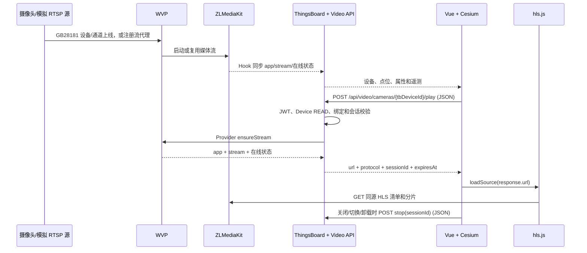

# 多摄像头视频流接入与复用指南

> 状态：项目级接入与验收指南  
> 适用范围：ThingsBoard Camera Device、Cesium 摄像头点位、Video API、WVP、ZLMediaKit、HLS、截图、PTZ、录像与回放  
> 架构前提：以 `docs/ai/video-platform-architecture.md` 为权威边界，以 `docs/api/video-api.md` 为接口契约

## 1. 目的

本指南把已成功显示 `sim-camera-001` 的完整闭环固化为可重复步骤。后续新增摄像头时，
原则上只新增设备、视频绑定、媒体源/通道和地图点位，不为每个摄像头复制播放器代码，
也不在前端新增厂商分支。

本指南同时区分两个容易混淆的目标：

- **新增多个独立摄像头源**：每路拥有独立设备、通道/流和绑定。
- **多宫格同时观看**：同一页面同时创建多个播放会话，属于独立的 UI 与容量任务。

单个 720p 源的 40 个并发观看者成功，不代表 40 个独立摄像头源已经通过容量验证。

## 2. 不可改变的核心边界

每路逻辑摄像头必须遵守以下映射：

```text
ThingsBoard Device UUID (tbDeviceId)
  -> video_camera_binding
  -> VideoProvider
  -> WVP 设备/通道或流代理
  -> ZLMediaKit app + stream
  -> Video API 返回的同源 /video-stream/.../hls.m3u8
```

必须遵守：

- `tbDeviceId` 是 API、权限、Cesium 点位和会话中的唯一主键。
- `cameraCode` 是同一租户内唯一、稳定、可读的业务编号。
- 页面展示名可以变化，不得用展示名替代 `tbDeviceId`。
- `video_camera_binding` 是 ThingsBoard Device 与媒体平台映射的正式数据源。
- 播放地址只由 `POST /api/video/cameras/{tbDeviceId}/play` 动态返回。
- 浏览器只使用同源 `/video-stream/...`，不直接访问 WVP、ZLMediaKit、RTSP 或内网地址。
- 所有带 JSON 请求体的 Video API 必须发送 `Content-Type: application/json`。
- 单路失败只能影响该视频区域，不能删除点位、改写全图状态或让其他点位变灰。

当前实现范围必须明确：

- `WvpVideoProvider` 的直播启动当前走 WVP 流代理查询/启动路径；真实 GB28181 设备/通道标识目前用于 PTZ 和录像能力，不能把“真实 GB28181 通道直播启动”写成已经完成。
- 因此，本指南当前可直接复制的是已存在或可注册为 WVP/ZLMediaKit 流代理的多路直播。真实 GB28181 直播启动需要单独完善 Provider 并验证，不能只靠新增绑定假定可用。
- 生产播放 Ticket/HTTP-only Cookie 尚未实现；本地同源 HLS 成功不能直接作为生产播放授权方案。
- 播放会话当前保存在单个 ThingsBoard 进程内存中，多节点部署前需要独立设计共享会话状态。
- `GET /api/video/cameras` 当前会逐条同步调用 Provider 描述所有绑定，复杂度随摄像头数量线性增长；单条坏 StreamProxy/上游异常还可能让整个列表失败。点击点位前的身份解析也会先调用该列表，因此上量前必须测试列表延迟和坏绑定隔离，列表聚合优化属于独立任务。

## 3. 已成功链路的完整流程



前端实际调用顺序：

1. Cesium 点位携带目标 `entityId=tbDeviceId`。
2. `MapHome.vue` 接收 `camera-click`，先显示点位静态信息。
3. `cameraDeviceRuntimeService.ts` 校验当前用户可访问的视频绑定，并保留仍可读取且精确绑定的原 UUID。
4. 同时读取设备、属性、遥测并调用 `startVideoPlayback(tbDeviceId)`。
5. `frontend/src/api/tb/video.ts` 使用 `postJson` 创建播放会话。
6. `CameraMonitorPopup.vue` 先校验响应 URL 为同源 `/video-stream/` 路径，仅移除历史兼容参数 `cookieCheck`，不推导或修复地址，再交给 `hls.js`。
7. 弹窗保存 `tbDeviceId + sessionId`；切换、关闭或卸载时通过统一会话服务调用 `stop`。
8. 旧的异步请求晚于新选择返回时，立即释放旧响应中的会话，不能覆盖当前摄像头。

## 4. 每路摄像头的数据模板

### 4.1 ThingsBoard Device

推荐一条可独立播放、告警和授权的通道对应一个 ThingsBoard Device：

| 字段 | 要求 | 示例 |
| --- | --- | --- |
| `tbDeviceId` | ThingsBoard 自动生成，后续保持不变 | `<device-uuid>` |
| Device Name | 推荐等于 `cameraCode` | `cam-campus-002` |
| Label/展示名 | 可读名称，可以修改 | `东门摄像头` |
| Customer | 分配给实际使用该大屏的客户 | `<customer>` |
| `supportsLive` | 支持直播时设为 `true` | `true` |
| `supportsPlayback` | 只有真实支持录像检索/回放时才设为 `true` | `false`/`true` |
| `supportsPtz` 等 | 按真实能力声明，禁止伪造 | `true`/`false` |
| 位置属性 | 经纬度、高度、区域等 | 业务值 |

设备在线与视频流在线是两个状态：

- `online` 表示 ThingsBoard 设备状态。
- `streamOnline` 表示媒体流状态。
- 设备在线不等于视频一定可播放；视频失败也不能把设备判为不存在。

### 4.2 video_camera_binding

通过租户管理员调用：

```http
PUT /api/video/devices/{tbDeviceId}/binding
Content-Type: application/json
```

模板：

```json
{
  "cameraCode": "cam-campus-002",
  "provider": "WVP_STREAM_PROXY",
  "providerDeviceId": null,
  "providerChannelId": null,
  "mediaServerId": "<ZLMediaKit实际mediaServerId>",
  "streamApp": "live",
  "streamId": "cam-campus-002-main",
  "preferredProtocol": "hls",
  "enabled": true
}
```

上例是当前可直接复用的 StreamProxy/模拟流模板。真实 GB28181 的 PTZ 和录像绑定才填
真实 `providerDeviceId/providerChannelId`；填入后也不代表当前 Provider 已具备 GB 通道直播启动能力。

唯一性要求：

- 每个 `tbDeviceId` 只能有一条绑定。
- 同一租户的 `cameraCode` 不能重复。
- 已启用绑定的 `providerDeviceId + providerChannelId` 不能重复指向两路逻辑摄像头。
- 每路独立媒体源使用独立 `streamId`；禁止复制上一台摄像头的 `streamId`。
- `mediaServerId` 必须使用 ZLMediaKit 配置或 Hook 载荷中的真实值，不能把容器名、显示名或示例值想当然地复制进去。
- 数据库目前没有强制 `mediaServerId + streamApp + streamId` 唯一；Hook 会更新所有精确命中该三元组的绑定，因此上线前必须人工或用只读脚本检查三元组唯一。增加数据库唯一约束属于需要单独批准的 schema/迁移任务。
- 绑定中禁止存 WVP 密码、ZLMediaKit Secret、RTSP 凭据、Device Token 和完整播放 URL。

### 4.3 两类 Provider 映射

真实 GB28181/NVR 多通道的身份和能力建模：

- 一个上级设备可以包含多个通道。
- 每个需要独立播放和授权的通道建立一个 ThingsBoard Device。
- 每条绑定保存相同或不同的 `providerDeviceId`，但必须使用各自唯一的 `providerChannelId`。
- 录像和 GB28181 PTZ 依赖真实的设备/通道标识。
- 当前 Provider 尚未完成真实 GB28181 通道的直播启动分支；接入前必须先完成该 Provider 能力及端到端验证。

本地模拟或 WVP/ZLMediaKit 流代理：

- 每路模拟源使用独立 RTSP 路径。
- 当前每路都必须在 WVP 中存在独立 StreamProxy 记录，其 `app + stream` 与绑定完全一致；`WvpVideoProvider` 会先调用 WVP `/api/proxy/one` 查记录，再调用 `/api/proxy/start`。
- 如需容器重启后的媒体流自恢复，可以再让 registrar 逐路向 ZLMediaKit 注册相同的独立 `app + streamId`，但这只是第二层媒体恢复，不能替代 WVP StreamProxy 记录。
- 当前 `virtual-camera-stream-registrar` 只硬编码向 ZLMediaKit 注册 `virtual-oilwell-cam-001` 一路，而且不会创建 WVP StreamProxy 记录；新增多路必须先逐路在 WVP 配置 StreamProxy，再按需要参数化 registrar。
- WVP StreamProxy 至少应逐路核对：`app`、`stream`、源 URL、媒体节点和启用状态；记录中不得向指南或普通日志复制源凭据。
- 模拟/RPC 摄像头的 `providerDeviceId/providerChannelId` 应留空；只要两者非空，PTZ 和录像会进入 GB28181 分支。
- 模拟源只验证它真实支持的能力；没有真实录像通道时不要声明 `supportsPlayback=true`。

### 4.4 Cesium 点位

每个点位至少保存：

```json
{
  "id": "camera-point-campus-002",
  "type": "camera",
  "entityId": "<ThingsBoard Device UUID>",
  "entityName": "cam-campus-002",
  "name": "东门摄像头",
  "longitude": 114.0,
  "latitude": 30.0,
  "height": 20
}
```

点位不保存权威 HLS、RTSP 或 WebRTC 地址。标题优先使用点位配置名称，设备属性中的
`cameraName` 只作为设备展示信息，避免异步加载后标题闪变。

## 5. 新增一批摄像头的标准步骤

对每路摄像头重复以下步骤；建议先完成一条再批量复制配置：

1. **规划唯一身份**：确定 `cameraCode`、展示名、上游设备/通道、`streamApp` 和唯一 `streamId`。
2. **确认媒体源**：模拟 RTSP/上游源能独立读取，且 WVP 存在与计划 `app + stream` 精确一致的 StreamProxy；两项都要满足。不同测试源应使用不同编号/时间叠字，便于识别串流。
3. **建立 ThingsBoard Device**：名称推荐等于 `cameraCode`，设置真实能力和位置属性。
4. **分配客户权限**：把 Device 分配给目标 Customer；后续必须用普通客户用户复测。
5. **建立视频绑定**：按本指南模板 PUT JSON，核对设备、通道、媒体节点、app 和 stream；当前直播 Provider 必须能通过 WVP StreamProxy 查询到精确 `app + stream`。
6. **建立 Cesium 点位**：`entityId` 必须是该 Device 的 UUID，不使用名称、Token 或 WVP 通道号。
7. **先验 API**：依次验证列表、详情、状态、播放、HLS 和停止。
8. **再验页面**：点击点位确认标题、颜色、协议、会话、实际画面和关闭释放。
9. **验证隔离**：停止其中一路源，只允许该路显示离线，其他点位和视频继续正常。
10. **验证列表退化**：临时禁用或破坏一条测试绑定，记录 `/api/video/cameras` 是否拖慢或整体失败；当前实现未做到单条异常完全隔离，上量前必须留证据。
11. **记录映射表**：只记录非敏感身份映射和验收结果，不复制密码、Token 或完整内部 URL。

推荐维护的非敏感接入表：

| cameraCode | tbDeviceId | Customer | providerDeviceId | providerChannelId | mediaServerId | app | streamId | 点位 ID | 验收 |
| --- | --- | --- | --- | --- | --- | --- | --- | --- | --- |
| `cam-campus-002` | `<uuid>` | `<customer>` | `<device>` | `<channel>` | `<actual-id>` | `live` | `cam-campus-002-main` | `camera-point-campus-002` | 待验收 |

## 6. 每路摄像头的验收顺序

### 6.1 身份与权限

- `GET /api/video/cameras` 能看到该 `tbDeviceId`，且没有其他租户同名设备被误选。
- `GET /api/video/cameras/{tbDeviceId}` 返回的 `cameraCode/app/stream` 与计划一致。
- 租户管理员和实际客户用户分别验证；客户用户只能看到已授权设备。
- 播放响应中的 `tbDeviceId` 必须与请求 UUID 完全一致。

### 6.2 播放闭环

```http
POST /api/video/cameras/{tbDeviceId}/play
Content-Type: application/json

{"protocol":"hls","streamProfile":"main"}
```

必须确认：

- HTTP 200。
- `status=ready` 或可解释的短暂 `starting`。
- `online=true`。
- `protocol=hls`。
- `sessionId` 非空。
- `url` 是同源 `/video-stream/.../hls.m3u8`。
- HLS 清单和至少一个媒体分片返回 200。

停止：

```http
POST /api/video/cameras/{tbDeviceId}/stop
Content-Type: application/json

{"sessionId":"<play返回的sessionId>","force":false}
```

关闭后应看到会话数下降；`readerCount` 与 `activeSessions` 含义不同，不能要求两者始终相等。

### 6.3 页面闭环

- 点位初始颜色反映各自设备/流状态。
- 点击目标点位后标题不闪成另一台设备或属性名称。
- 显示 `设备在线`、`视频流正常`、`播放协议: hls`、`直播会话: 已建立`。
- 显示实际目标画面，不串到其他摄像头。
- 快速从 A 切换到 B 时，A 的迟到响应被释放，B 保持当前画面。
- 关闭弹窗、切换路由和组件卸载均释放会话。
- 一路失败时其他点位颜色、遥测和告警继续更新。

## 7. 多路场景的前端复用规则

当前地图弹窗是单选单播模型：用户一次打开一路，切换时释放上一会话。按上述数据模型
新增点位无需复制 `CameraMonitorPopup` 或 `hls.js` 代码。

如果后续建设 2×2、3×3 或 4×4 多宫格：

- 每个格子必须独立保存 `tbDeviceId + sessionId + Hls实例`。
- 关闭格子、替换摄像头和销毁页面时逐格释放。
- 缩略图列表使用截图并按可见区域懒加载，不要让几十路 HLS 常驻作为缩略图。
- 状态列表主要使用 ThingsBoard WebSocket/遥测，不要对每路高频轮询 `/status`。
- 并发播放数量应有上限，并在目标硬件上用多个独立视频源重新压测。
- 当前 API 没有批量状态、批量播放和持久化监控分组；需要这些能力时另立任务设计，不能在页面私自绕过 Video API。
- HLS 致命播放错误当前会销毁播放器，但不会立刻释放直播会话；会在用户关闭/切换或后端 TTL 时回收。多宫格设计应补充致命错误立即释放策略。

## 8. 本次故障沉淀的经验

### 8.1 截图和状态正常，不代表播放请求正确

本次页面能刷新媒体状态和截图，但 `play` 仍失败。原因是 GET 请求正常，而播放 POST
错误地使用了：

```text
application/x-www-form-urlencoded;charset=UTF-8
```

后端要求 `application/json`。因此：

- Video API 的播放、停止、PTZ、录像播放/控制/停止统一使用 `postJson`。
- 绑定 PUT 显式声明 `application/json`。
- 不能因为状态/截图成功就跳过播放接口响应体检查。
- 应补充前端请求契约测试，机械验证所有带请求体的 Video API 使用 JSON；当前专项自动化测试仍是缺口。

### 8.2 同名设备不能代替 UUID

多个租户可以存在同名 `sim-camera-001`。只要原 `tbDeviceId` 可读且存在精确绑定，运行时
必须保留原 UUID，不能根据名称重定向到另一租户设备。

### 8.3 设备在线、流在线、会话建立是三层状态

```text
设备在线 != 视频流在线 != 当前页面已建立播放会话
```

页面应分别展示，诊断时也应分层检查。

### 8.4 视频失败必须局部降级

播放失败不得清空点位状态集合，也不得把全部点位改成灰色。地图状态继续来自 ThingsBoard，
播放错误只显示在目标视频区域。

### 8.5 展示名不参与身份

点位名 `sim-camera-001` 与设备属性 `cameraName=virtual-camera-001` 可以不同。标题闪变属于
展示优先级问题，不代表 Device UUID 或视频绑定发生变化。

## 9. 故障定位决策树

按以下顺序定位，不要先修改数据库或密码：

1. **确认请求 UUID**：浏览器请求必须是目标 `tbDeviceId`。
2. **确认 Content-Type**：所有 JSON POST/PUT 必须为 `application/json`。
3. **读取 Video API 错误**：
   - `401`：JWT 缺失或失效。
   - `403`：Customer/Device 权限不足，或普通用户执行管理员操作。
   - `404`：Device、绑定、会话或上游代理不存在。
   - `409`：绑定被禁用。
   - `502`：WVP/ZLMediaKit 调用失败或超时。
   - `503`：视频集成或必要服务端配置未启用。
4. **核对绑定**：`tbDeviceId/cameraCode/providerDeviceId/providerChannelId/mediaServerId/app/stream`。
5. **核对上游**：WVP StreamProxy 存在并能按精确 `app + stream` 查询，ZLMediaKit 能看到相同流；WVP 管理页面能打开不等于目标代理记录存在。
6. **核对响应**：`play` 是否返回 `sessionId/protocol/url`。
7. **核对 HLS**：同源清单和分片是否 200，HTTPS 页面不能请求不安全或内网媒体 URL。
8. **核对播放器生命周期**：是否被迟到请求、切换 watcher 或卸载逻辑立即释放/覆盖。
9. **只在证据指向凭据时处理密码**：不得把修改 WVP 用户密码作为通用首选修复。

补充判断：截图直接查询 ZLMediaKit，直播启动还要经过 WVP StreamProxy。因此截图成功、
状态可刷新但 `play` 失败是完全可能的，必须继续检查 StreamProxy 和播放 POST。

## 10. 多独立视频源的容量与运维

已知基线只证明一个 720p H.264/AAC 源可以被 40 个同源 HLS 观看者读取。增加多个独立
源时，还会新增以下成本：

- 每路上游拉流、RTP/RTSP 连接和端口。
- ZLMediaKit 解复用、封装、GOP 缓存；若启用转码则增加大量 CPU。
- WVP 设备/通道信令、Hook 和媒体节点状态维护。
- 每路录像的磁盘吞吐、容量、索引与回放会话。
- ThingsBoard 遥测、WebSocket、截图缓存和数据库增长。
- 浏览器每路 HLS 的网络、解码、内存和 Hls 实例。

扩容测试应使用多个独立源，按 1、2、4、8、16 路阶梯进行，并记录：

- 各服务 CPU、内存、句柄/连接数。
- 上下行带宽、HLS 首帧时间和卡顿/错误率。
- WVP/ZLMediaKit 超时、Hook 失败和流恢复时间。
- `activeSessions`、`readerCount`、会话释放和 TTL 清理。
- `/api/video/cameras` 在不同绑定数量下的 p50/p95/p99，以及单条坏 StreamProxy 是否导致整表失败。
- 录像磁盘写入、增长速度和保留策略。
- ThingsBoard 遥测/队列和 PostgreSQL 增长。

达到内存安全线、持续 5xx、流丢失、队列满或数据丢失时立即停止上探。多节点
ThingsBoard 部署前还需把当前应用内存中的播放会话迁移到共享状态存储；该变化属于独立架构任务。

另有以下需要独立加固的现状：

- 可提交的视频平台配置中存在硬编码媒体 API 凭据的历史安全债。不得复制其值到新配置；进入共享或生产环境前应另立安全任务完成轮换和环境变量化。
- 摄像头运行时和最近截图缓存缺少面向大量不同摄像头的全局淘汰策略；大量摄像头长期被访问前应增加堆内存观测，并在独立任务中评估有界缓存。
- Hook 状态缓存也会按 `mediaServerId + app + stream` 创建状态且没有全局淘汰；流频繁增删时同样要观察堆内存增长。

## 11. 批量上线验收矩阵

| 层级 | 单路必测 | 批量必测 | 失败时回退 |
| --- | --- | --- | --- |
| 身份 | UUID、cameraCode、Customer | 无重复 UUID/业务编号/通道/stream | 禁用新绑定，不删除 Device |
| 媒体 | 上游在线、精确 app+stream | 逐路独立画面、断一路不影响其他路 | 停止目标源或移除目标代理 |
| API | list/details/status/play/HLS/stop | 普通客户用户逐路抽检 | `enabled=false` 或恢复原绑定 |
| 地图 | 标题、位置、颜色、点击播放 | 快速切换、故障隔离、无全图变灰 | 移除目标点位配置，不删历史设备 |
| 会话 | 创建和释放 | 多用户/多格会话计数与 TTL | 关闭新页面入口，等待 TTL 清理 |
| 容量 | 一路首帧与稳定性 | 多独立源阶梯压测 | 回退到上一个稳定档位 |

## 12. 明确禁止项

- 禁止以 Device Token、设备名、Label、WVP 通道号或 `streamId` 替代 `tbDeviceId`。
- 禁止为新增摄像头复制上一条绑定后只改展示名。
- 禁止多路独立源共用 `streamId` 或上游设备/通道组合。
- 禁止前端拼接 `/live`、替换 `hls.m3u8`、生成 `localhost:8888` 或从 RTSP 推导 HLS。
- 禁止在浏览器、普通日志、遥测和绑定中暴露凭据。
- 禁止在会话释放失败日志中长期输出包含请求配置的原始 Axios 错误对象；后续安全加固应只保留状态码和脱敏消息。
- 禁止把 `supportsPlayback`、PTZ 或音频能力默认设为 true。
- 禁止用管理员播放成功代替实际客户用户权限验收。
- 禁止把单源多观看者结果当作多摄像头容量结论。
- 禁止一路视频失败时删除 Device、绑定历史数据或修改其他点位状态。

## 13. 复用完成定义

一批新增摄像头只有同时满足以下条件才算完成：

- 每路拥有唯一且正确授权的 `tbDeviceId`。
- 每路绑定精确指向自己的 Provider 设备/通道和 `app + stream`。
- 租户管理员与目标客户用户均通过权限范围内的 API 验证。
- 播放使用 JSON 请求，返回同源 HLS、协议和会话 ID。
- 浏览器显示正确画面，标题稳定，其他点位状态不受影响。
- 切换、关闭和卸载均释放正确会话。
- 单路断流只影响单路，恢复后无需修改前端地址。
- 多独立源容量测试与单源多观看者测试分别记录，不混淆结论。
- 任务记录不包含密码、Token、Secret 或内部 RTSP URL。
