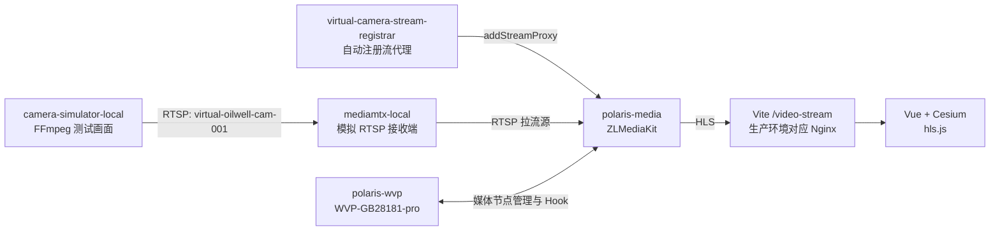
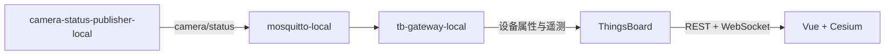
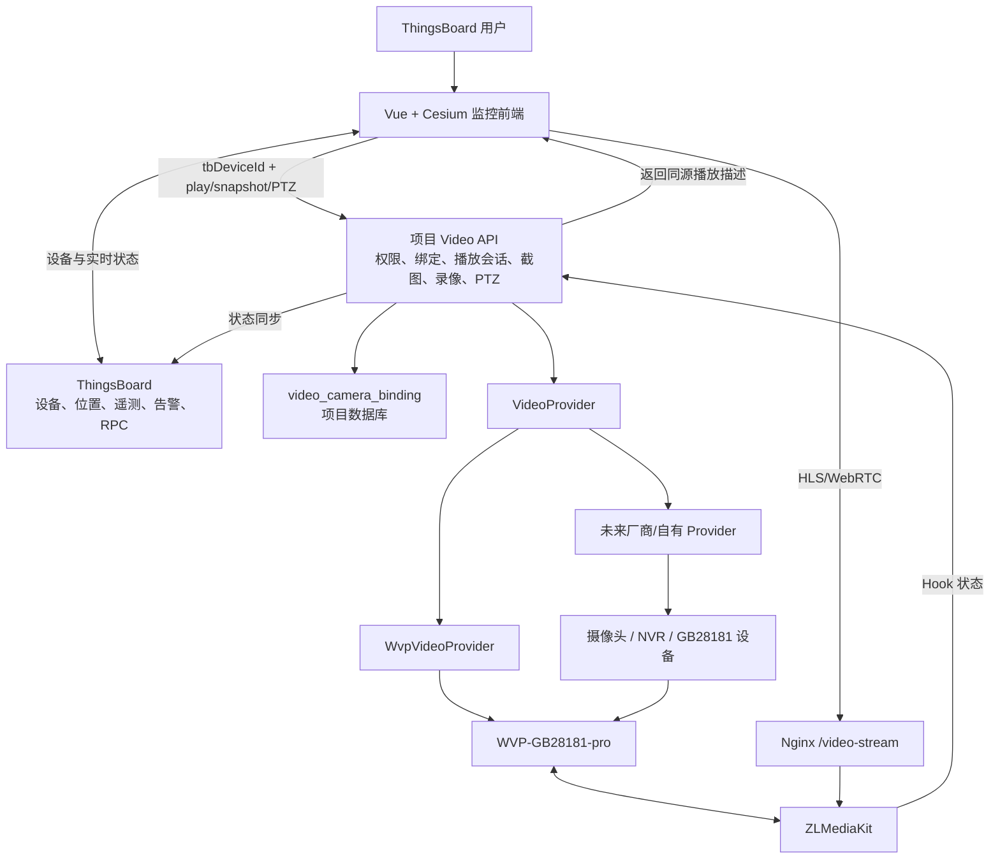
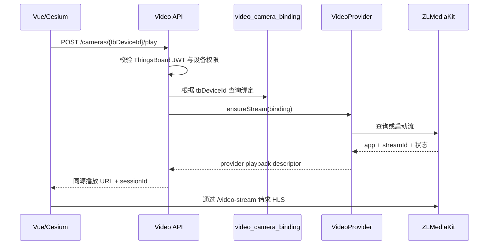
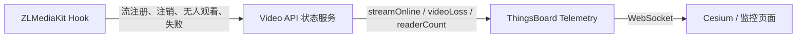

# 视频平台架构与 AI 实施约束

> 状态：项目级权威架构文档  
> 最后更新：2026-07-28  
> 适用范围：ThingsBoard、Vue、Cesium、WVP-GB28181-pro、ZLMediaKit、模拟摄像头、Video API、监控页面  
> 强制要求：任何 AI 在分析或修改视频、摄像头、ThingsBoard 摄像头身份、WVP、
> ZLMediaKit、Video API、Cesium 摄像头点位或本地视频环境之前，必须完整阅读本文档。
> 其他任务按 `docs/ai/architecture-index.md` 路由。

## 1. 文档目标

本文档用于统一项目中摄像头身份、视频接入、播放地址、状态同步、地图点位、监控缩略图、PTZ、录像回放和部署运维方案。

本文档同时解决以下历史问题：

- ThingsBoard 设备名称、Token、摄像头编号和视频流编号混用。
- 前端、ThingsBoard 属性、mock 数据和播放器同时生成播放地址。
- MediaMTX 的 `index.m3u8` 与 ZLMediaKit 的 `hls.m3u8` 混用。
- `/live`、`/video-stream`、`localhost:8888` 和 `127.0.0.1` 多套地址并存。
- 前端根据 RTSP/WebRTC 地址自行推导 HLS，导致 `stream not found`。
- 浏览器把 `/video-stream/...` 误判为 MediaMTX 流名称。
- 开发环境可以播放，但换电脑、换域名或部署 HTTPS 后失效。

本文档中的“必须”“禁止”“唯一”属于项目架构约束。除非用户明确改变架构，否则后续实现不得绕过。

## 2. 核心架构结论

项目采用以下核心方案：

- 摄像头在 ThingsBoard 中建模为 `Device`。
- ThingsBoard Device UUID 是项目内部唯一主键。
- `cameraCode` 是稳定的业务编号。
- Device Token 仅用于认证，绝不能作为设备身份或数据库关联键。
- 项目自己的 Video API 是前端访问视频能力的唯一业务入口。
- WVP-GB28181-pro 负责 GB28181 设备、通道、信令和视频平台管理。
- ZLMediaKit 负责实际拉流、转协议、HLS/WebRTC/RTSP、截图、录像和媒体状态。
- ThingsBoard 负责设备管理、位置、属性、遥测、告警、关系和 RPC。
- Cesium 点位绑定 ThingsBoard Device UUID，不保存权威播放地址。
- 运行时播放地址由 Video API 动态返回，不以 ThingsBoard 属性为正式数据源。
- 浏览器只使用同源 `/video-stream/...` 地址，不直接访问媒体服务器内网地址。

## 3. 当前已验证链路

当前本地验证环境已经运行以下链路：



设备状态链路：



当前本地验证结果：

- MediaMTX 成功接收 H264 + AAC。
- ZLMediaKit 成功输出 HLS、RTSP、RTMP、TS 和 fMP4。
- HLS 清单返回 HTTP 200，并包含 `#EXTM3U`。
- HLS MPEG-TS 分片返回 HTTP 200。
- MQTT 状态包含 `online=true`、`streamOnline=true`、`recording=true`、`videoLoss=false`。
- 前端可以通过 `/video-stream/live/virtual-oilwell-cam-001/hls.m3u8` 播放。

MediaMTX 只用于本地模拟 RTSP 源。真实 GB28181 或厂商摄像头接入后，不应让前端感知 MediaMTX。

## 4. 目标生产架构



## 5. 摄像头身份模型

### 5.1 身份层次

每个逻辑摄像头至少具有以下身份：

| 字段 | 示例 | 职责 | 可变性 |
| --- | --- | --- | --- |
| `tbDeviceId` | ThingsBoard UUID | 项目内部主键、API 路径、关系和权限 | 不可变 |
| `cameraCode` | `cam-oilwell-001` | 稳定业务编号 | 原则上不可变 |
| `deviceName` | `cam-oilwell-001` | ThingsBoard 名称、Gateway 子设备识别 | 尽量不可变 |
| `label` / `cameraName` | `1号油井东侧摄像头` | 页面展示 | 可变 |
| `videoBindingId` | 绑定记录 UUID | 视频系统映射 | 不可变 |
| `provider` | `wvp` | 视频提供方 | 可变 |
| `providerDeviceId` | GB28181 设备编号 | 外部平台设备 | 可变 |
| `providerChannelId` | GB28181 通道编号 | 外部平台通道 | 可变 |
| `mediaServerId` | `polaris` | 媒体节点 | 可变 |
| `streamApp` | `live` | ZLMediaKit app | 尽量稳定 |
| `streamId` | `virtual-oilwell-cam-001` | 媒体路由标识 | 尽量稳定 |
| `accessToken` | 随机密钥 | ThingsBoard 认证 | 可轮换，禁止作为身份 |

### 5.2 主键选择

项目 API、数据库外键、Cesium 点位绑定和权限判断必须使用 `tbDeviceId`。

如果需要可读业务编号，使用 `cameraCode`。新设备推荐：

```text
ThingsBoard Device Name = cameraCode
ThingsBoard Device Label = 中文展示名称
```

### 5.3 Token 规则

Device Token 只用于连接认证：

- Token 可以轮换，轮换不能改变摄像头身份。
- Token 不得出现在前端、播放 URL、遥测、日志和数据库业务外键中。
- 通过 ThingsBoard Gateway 接入的摄像头子设备通常不需要独立 Token。
- 当前 Gateway 使用 Gateway Token，子设备通过 `cameraCode` 或 `cameraId` 区分。
- 后续 Gateway mapping 应统一以 `cameraCode` 作为 `deviceNameExpression`。

### 5.4 逻辑监控点

ThingsBoard Camera Device 表示“逻辑监控点”，不强制代表一台永不更换的物理硬件。

摄像头损坏并更换硬件时，如果监控位置和业务含义不变：

- 保留同一个 `tbDeviceId` 和 `cameraCode`。
- 更新厂商设备编号、通道编号和视频绑定。
- 保留历史遥测、告警、Cesium 点位和业务关系。

### 5.5 NVR 多通道

一个 NVR/GB28181 设备可以包含多个通道。项目中：

- NVR 或 GB28181 上级设备可建模为 Asset、Gateway 或独立 Device。
- 每个可独立显示、告警和播放的摄像头通道对应一个 ThingsBoard Camera Device。
- `providerDeviceId + providerChannelId` 唯一定位外部通道。

## 6. 数据归属与唯一数据源

### 6.1 ThingsBoard

ThingsBoard 是以下数据的正式数据源：

- Device UUID、名称、Label、Device Profile。
- 客户分配、租户权限和设备关系。
- 摄像头型号、位置、区域和能力属性。
- 在线、流状态、码率、帧率、告警、运动侦测等遥测。
- RPC 控制入口和历史遥测。

推荐静态属性：

```text
cameraCode
cameraName
cameraModel
videoBindingId
supportsLive
supportsPlayback
supportsPtz
supportsZoom
supportsPreset
supportsAudio
longitude
latitude
height
siteId
areaId
```

推荐遥测：

```text
online
streamOnline
videoLoss
recording
motionDetected
alarm
tamperAlarm
fps
bitrate
delayMs
readerCount
lastHeartbeatTs
```

### 6.2 项目数据库

项目数据库中的 `video_camera_binding` 是视频平台映射的正式数据源。

建议字段：

```text
id
tenant_id
tb_device_id
camera_code
provider
provider_device_id
provider_channel_id
media_server_id
stream_app
stream_id
main_stream_id
sub_stream_id
preferred_protocol
enabled
created_time
updated_time
```

关键约束：

- `tb_device_id` 唯一。
- `tenant_id + camera_code` 唯一。
- `provider + provider_device_id + provider_channel_id` 在有效记录中唯一。
- 禁止存储 WVP 密码、摄像头 RTSP 密码和 ZLMediaKit Secret 明文。

### 6.3 Video API

Video API 是运行时视频能力的唯一业务入口：

- 根据 `tbDeviceId` 查找绑定。
- 校验 ThingsBoard JWT、租户、客户和设备权限。
- 选择 `VideoProvider`。
- 启动、复用或停止视频流。
- 返回播放描述。
- 提供截图、PTZ、录像和回放。
- 接收媒体 Hook 并同步 ThingsBoard 状态。

### 6.4 前端

前端只负责：

- 使用 `tbDeviceId` 渲染和选择摄像头。
- 从 ThingsBoard 获取设备、点位、遥测和告警。
- 在用户点击时调用 Video API。
- 使用 Video API 返回的 URL 播放。
- 不推导、不拼接、不修复厂商播放地址。

## 7. 播放地址架构

### 7.1 核心决定

运行时播放地址不再作为 ThingsBoard 设备属性的正式数据源。

以下旧属性可以在迁移期间保留，但最终前端不得依赖：

```text
hlsUrl
streamUrl
streamUrlMain
webRtcUrl
rtspUrl
monitorPageUrl
```

ThingsBoard 可以保留 `streamApp`、`streamId` 或 `videoBindingId` 等稳定标识，但完整播放 URL 必须由 Video API 动态返回。

### 7.2 唯一前端 HLS 格式

当前阶段唯一合法的前端 HLS 地址格式：

```text
/video-stream/{app}/{streamId}/hls.m3u8
```

当前模拟摄像头：

```text
/video-stream/live/virtual-oilwell-cam-001/hls.m3u8
```

### 7.3 地址分层

诊断地址，只允许服务器本机使用：

```text
http://127.0.0.1/live/{streamId}/hls.m3u8
```

开发环境浏览器地址：

```text
https://localhost:5173/video-stream/{app}/{streamId}/hls.m3u8
```

生产环境浏览器地址：

```text
https://项目域名/video-stream/{app}/{streamId}/hls.m3u8
```

开发环境由 Vite 代理，生产环境由 Nginx 代理。前端业务代码始终只保存和使用相对同源地址。

### 7.4 禁止的地址

前端、ThingsBoard 权威属性和 Video API 响应中禁止出现：

```text
http://localhost:8888/...
http://127.0.0.1/...
/live/...
.../index.m3u8
rtsp://用户名:密码@...
```

例外：

- `127.0.0.1` 可用于服务器本机健康检查。
- RTSP 地址可存在于受保护的后端配置或加密凭证存储。
- MediaMTX 的 8888/8889 只允许本地模拟链路内部调试。

### 7.5 前端播放器约束

前端播放器必须把 Video API 返回的 `url` 直接交给 `hls.js`：

```text
hls.loadSource(playResponse.url)
```

前端禁止：

- 从 RTSP 推导 HLS。
- 从 WebRTC 推导 HLS。
- 根据端口判断媒体服务器类型。
- 自动添加 `/live`。
- 根据第一个路径段猜测 `streamId`。
- 自动创建 `localhost:8888` 预览页。
- 将 `hls.m3u8` 替换成 `index.m3u8`。
- 对标准 HLS 相对分片进行不必要的文本重写。

允许的轻量处理：

- 验证 URL 是同源相对地址。
- 验证 URL 前缀属于 `/video-stream/`。
- 对非法 URL 明确报错，不进行“智能修复”。

### 7.6 `cookieCheck`

历史上的 `cookieCheck=1` 来自 MediaMTX 内置预览页面或浏览器探测逻辑，不属于项目播放协议。

当前 Vite `/video-stream` 代理会移除该参数作为兼容保护，但目标架构不依赖此修复。去除旧 MediaMTX iframe 后，正常 HLS 请求不应产生该参数。

## 8. Video API 设计

### 8.1 当前状态

项目已经存在 Video API 第一版和 `VideoProvider` / `WvpVideoProvider` 抽象。

当前代码属于第一阶段，后续必须逐步改为以 `tbDeviceId` 为主键。不得让前端直接保存 WVP 用户名、密码、Session 或 ZLMediaKit Secret。

### 8.2 目标接口

```text
GET    /api/video/cameras
GET    /api/video/cameras/{tbDeviceId}
POST   /api/video/cameras/{tbDeviceId}/play
POST   /api/video/cameras/{tbDeviceId}/stop
GET    /api/video/cameras/{tbDeviceId}/status
GET    /api/video/cameras/{tbDeviceId}/snapshot
POST   /api/video/cameras/{tbDeviceId}/ptz
GET    /api/video/cameras/{tbDeviceId}/recordings
POST   /api/video/cameras/{tbDeviceId}/recordings/play
```

### 8.3 播放请求

```json
{
  "protocol": "hls",
  "streamProfile": "main"
}
```

### 8.4 播放响应

```json
{
  "tbDeviceId": "ThingsBoard Device UUID",
  "cameraCode": "cam-oilwell-001",
  "sessionId": "短期播放会话 ID",
  "status": "ready",
  "protocol": "hls",
  "url": "/video-stream/live/virtual-oilwell-cam-001/hls.m3u8",
  "alternates": {
    "webrtc": "",
    "flv": ""
  },
  "expiresAt": 1785200000000
}
```

### 8.5 播放处理



### 8.6 Provider 扩展

所有视频来源必须实现统一 Provider 边界，例如：

```text
WvpVideoProvider
HikvisionVideoProvider
DahuaVideoProvider
EzvizVideoProvider
CustomVideoProvider
```

Provider 负责厂商差异，前端和 Cesium 不允许出现厂商 API 判断。

## 9. Cesium 点位与监控播放

Cesium 摄像头点位必须绑定：

```text
tbDeviceId
```

推荐点位运行时结构：

```json
{
  "pointId": "cesium-point-id",
  "tbDeviceId": "ThingsBoard Device UUID",
  "cameraCode": "cam-oilwell-001",
  "cameraName": "1号油井摄像头",
  "longitude": 114.0,
  "latitude": 30.0,
  "height": 20,
  "online": true,
  "streamOnline": true,
  "alarm": false
}
```

点位数据中不需要长期保存播放 URL。

播放流程：

1. 地图加载 ThingsBoard 设备、点位绑定和最新遥测。
2. 地图根据 `tbDeviceId` 更新点位状态。
3. 用户点击摄像头点位。
4. 前端调用 `/api/video/cameras/{tbDeviceId}/play`。
5. Video API 返回播放描述。
6. 弹窗将 `url` 交给 `hls.js`。
7. 弹窗关闭时按需要调用 `stop` 或释放观看会话。

Video API 暂时不可用时：

- Cesium 点位仍应显示。
- ThingsBoard 设备状态和告警仍应更新。
- 视频区域显示“视频服务暂不可用”。
- 不得把整个点位标记为不存在。

## 10. 流状态与 ThingsBoard 同步

### 10.1 当前过渡方案

当前容器化 `camera-status-publisher-local` 通过请求真实 HLS 清单判断：

```text
streamOnline
recording
videoLoss
```

这适合单个模拟摄像头验证，不是大规模生产最终方案。

### 10.2 目标方案

生产环境应使用 ZLMediaKit Hook 和 Video API 维护流状态：



推荐处理的事件：

- 流注册成功。
- 流注销。
- 拉流失败。
- 无人观看。
- 播放人数变化。
- 录像开始和结束。
- 媒体服务器上线和离线。

## 11. 流生命周期

目标策略：


### 11.1 UUID 绑定实现记录

#### 2026-07-28

- Added the PostgreSQL `video_camera_binding` table to the clean-install schema,
  upgrade SQL, and an idempotent application-start initializer for existing local
  databases.
- Added tenant-scoped binding lookup, upsert, delete, and provider selection in
  the ThingsBoard application module.
- The canonical live-play route is now
  `POST /api/video/cameras/{tbDeviceId}/play`.
- `POST /api/video/devices/{tbDeviceId}/play` remains a temporary route alias.
- A non-UUID value in the canonical route is accepted only as a migration fallback:
  it must resolve through a tenant-owned `cameraCode` binding and still pass the
  ThingsBoard device READ permission check.
- Binding management routes are under
  `/api/video/devices/{tbDeviceId}/binding`; writes require `TENANT_ADMIN`.
- The playback response now exposes canonical `protocol` and `url` fields while
  retaining `hlsUrl`, `flvUrl`, and `webRtcUrl` for compatibility.
- Cesium camera runtime loading calls the Video API with the point's ThingsBoard
  Device UUID. Legacy ThingsBoard URL attributes are fallback-only during migration.
- Removed frontend RTSP/WebRTC-to-HLS derivation, localhost port rewriting, `/live`
  guessing, MediaMTX session propagation, and HLS playlist text rewriting.
- The local `sim-camera-001` ThingsBoard device UUID is bound to
  `live/virtual-oilwell-cam-001`; its browser URL remains
  `/video-stream/live/virtual-oilwell-cam-001/hls.m3u8`.
- 第一个观看者请求播放时启动或复用视频流。
- 有观看者时保持视频流。
- 最后一个观看者离开后延迟停止。
- 停止延迟用于避免频繁打开、关闭弹窗造成拉流抖动。
- 对必须常开的监控流支持 `alwaysOn` 策略。
- 媒体节点或源摄像头重启后自动恢复。

建议状态：

```text
offline
starting
ready
degraded
stopping
failed
```

## 12. 缩略图与多宫格监控

列表页禁止同时播放几十路 HLS 作为缩略图。

推荐：

```text
GET /api/video/cameras/{tbDeviceId}/snapshot
```

处理原则：

- ZLMediaKit 或 Provider 负责截图。
- Video API 缓存截图。
- 前端按可见区域懒加载。
- 图片按合理周期刷新。
- 用户点击缩略图后才创建真实播放会话。

监控页面后续支持：

- 2×2、3×3、4×4 多宫格。
- 区域、状态、告警筛选。
- 摄像头搜索和分组。
- 缩略图放大播放。
- 跳转 Cesium 点位。
- 流异常和设备离线标记。

## 13. PTZ、录像与回放

PTZ 调用统一走 Video API：

```text
POST /api/video/cameras/{tbDeviceId}/ptz
```

前端不直接调用 WVP、厂商 SDK 或 MQTT。

Provider 可将命令转换为：

- WVP/GB28181 PTZ。
- 厂商 API。
- ThingsBoard RPC。
- Gateway MQTT Topic。

录像和回放也必须通过 Video API 屏蔽 Provider 差异。

## 14. 安全约束

必须遵守：

- Video API 使用现有 ThingsBoard JWT 模型校验用户。
- 根据 Tenant、Customer 和 Device 权限限制视频访问。
- WVP 凭证只保存在后端环境变量或安全配置。
- ZLMediaKit Secret 不得返回浏览器。
- RTSP 用户名和密码不得出现在前端、ThingsBoard 遥测和普通日志。
- Device Token 不得作为摄像头主键。
- 生产 `/video-stream` 必须走 HTTPS 和反向代理。
- 生产环境应加入短期播放 Ticket 或 HTTP-only Cookie。
- 不建议把 ThingsBoard JWT 直接附加到每个 HLS 分片 URL。

## 15. 本地容器化验证环境

### 15.1 Compose 项目

`camera`：

- `mediamtx-local`
- `camera-simulator-local`

`tb-video-validation`：

- `polaris-media`
- `polaris-wvp`
- `polaris-nginx`
- `redis`
- `virtual-camera-stream-registrar`

`simulation-equipment-flow`：

- `mosquitto-local`
- `sensor-simulator-local`
- `camera-status-publisher-local`
- `tb-gateway-local`

三个 Compose 项目通过外部网络：

```text
video-iot-net
```

### 15.2 一键启动

```powershell
powershell -ExecutionPolicy Bypass -File E:\simulationEquipment\start-all.ps1
```

宿主机旧脚本只用于人工调试，不得和容器同时运行：

```text
E:\simulationEquipment\_runtime\run-ffmpeg.ps1
E:\simulationEquipment\virtual-devices\camera\send-camera-status.ps1
```

### 15.3 本地入口

```text
WVP:
http://127.0.0.1:18080

ZLMediaKit 本机诊断:
http://127.0.0.1/live/virtual-oilwell-cam-001/hls.m3u8

前端同源播放:
/video-stream/live/virtual-oilwell-cam-001/hls.m3u8
```

## 16. 迁移计划

### 阶段 A：稳定当前链路

- 验证 Docker、媒体节点、模拟源和 ThingsBoard 后端重启恢复。
- 验证断流后 `streamOnline=false`、恢复后自动变为 `true`。
- 保证前端不再请求 `localhost:8888/video-stream/index.m3u8`。

### 阶段 B：统一身份

- 所有摄像头以 ThingsBoard Device UUID 作为项目主键。
- 确定 `cameraCode` 命名规范。
- Cesium 点位绑定 `tbDeviceId`。
- 建立 `video_camera_binding`。

### 阶段 C：完善 Video API

- 将 API 路径统一为 `{tbDeviceId}`。
- 完成绑定查询、权限、流启动、状态、停止和 Provider。
- 播放响应返回唯一同源 URL。

### 阶段 D：前端迁移

- Video API 播放地址优先。
- ThingsBoard 旧 URL 属性仅作为临时回退。
- 验证所有摄像头完成绑定后停止发布旧 URL 属性。
- 删除前端 RTSP/WebRTC 推导 HLS 和 MediaMTX 兼容逻辑。

### 阶段 E：缩略图与监控页

- 完成截图 API 和缓存。
- 完成多宫格监控。
- 增加搜索、区域、在线和告警筛选。

### 阶段 F：生产能力

- ZLMediaKit Hook 状态同步。
- 播放 Ticket。
- PTZ。
- 录像和回放。
- 多媒体节点、健康检查、日志和指标。

## 17. 验收标准

身份：

- 前端和后端业务 API 使用 `tbDeviceId`。
- Token 不参与身份关联。
- 改 Label 不影响播放和历史数据。

播放：

- 前端只请求 `/video-stream/...`。
- 项目正常运行时没有 `localhost:8888`、错误 `/live` 或 `index.m3u8` 请求。
- 开发和生产使用相同相对 URL 规则。
- HLS 清单和分片均能通过同源代理访问。

状态：

- 设备在线与视频流在线是两个独立状态。
- 源视频停止后 `videoLoss=true`。
- 源视频恢复后无需人工登录 WVP 操作。

地图：

- Video API 故障不影响 ThingsBoard 设备和 Cesium 点位显示。
- 点击点位时才请求播放会话。

扩展：

- 新 Provider 不需要修改 Cesium 和播放器核心逻辑。
- 新媒体节点不需要修改 ThingsBoard 设备属性中的播放 URL。

安全：

- 前端看不到 WVP 密码、ZLMediaKit Secret、RTSP 密码和 Device Token。
- 非授权用户不能通过 Video API 创建播放会话。

## 18. AI 修改约束

后续 AI 必须遵守：

1. 修改视频、摄像头、ThingsBoard 摄像头身份、Video API、Cesium 摄像头点位或
   视频基础设施代码前，完整阅读本文档；其他任务按架构索引路由。
2. 先检查当前工作树，保留用户已有修改。
3. 不得重新使用 Token 作为摄像头身份。
4. 不得把完整运行时播放 URL 重新设为 ThingsBoard 权威属性。
5. 不得在前端新增 RTSP/WebRTC 到 HLS 的自动推导。
6. 不得新增 `localhost:8888` 或基于 MediaMTX iframe 的默认播放逻辑。
7. 不得让前端直接调用带凭证的 WVP、ZLMediaKit 或厂商 API。
8. 播放、截图、PTZ、录像能力必须经过 Video API 和 Provider 边界。
9. 新增或改变身份字段、URL 规则、API 契约、网络拓扑时，必须同步更新本文档。
10. 任何迁移必须保留当前可播放链路，提供回退策略和验收步骤。

## 19. 当前已知过渡项

以下内容仍属于过渡状态，不应被后续 AI 误认为最终架构：

- ThingsBoard 当前仍可能存在 `hlsUrl`、`streamUrl`、`streamUrlMain`、`webRtcUrl` 和 `rtspUrl` 属性。
- 前端仍保留部分旧 `/live` 和 MediaMTX 兼容代码。
- 当前模拟摄像头状态使用 HLS 轮询，不是 ZLMediaKit Hook。
- 当前模拟摄像头的 `tbDeviceName` 为 `sim-camera-001`，`streamId` 为 `virtual-oilwell-cam-001`。
- Video API 第一版尚未全部切换为 ThingsBoard Device UUID。
- 本地环境仍使用 MediaMTX 作为模拟 RTSP 源，真实生产摄像头不一定需要它。

后续改造必须按本文档的迁移计划逐步消除这些过渡项。

## 20. 决策记录

### 2026-07-28

- 选择 WVP-GB28181-pro + ZLMediaKit 作为主视频方案。
- 摄像头作为 ThingsBoard Device 管理。
- 选择 ThingsBoard Device UUID 作为项目内部主键。
- Device Token 只用于认证。
- 选择项目数据库 `video_camera_binding` 管理视频映射。
- 运行时播放 URL 由 Video API 动态生成。
- ThingsBoard 不再作为完整播放 URL 的最终正式数据源。
- 前端唯一 HLS 路径采用 `/video-stream/{app}/{streamId}/hls.m3u8`。
- Cesium 点位绑定 `tbDeviceId`，点击时调用 Video API 播放。
- 当前模拟摄像头、状态发布器和流注册器完成容器化。

### 2026-08-07

- AI 必读文档改为由 `docs/ai/architecture-index.md` 按任务范围路由，避免非视频任务
  重复加载整份视频架构文档。
- 所有涉及视频、摄像头身份、Video API、Cesium 摄像头点位、WVP、ZLMediaKit 和
  本地视频环境的任务仍必须完整阅读本文档。
- 本次调整只改变 AI 协作治理和上下文加载范围，不改变任何运行时架构、数据模型、
  API 契约、迁移路径或兼容行为，因此不需要代码或数据迁移。

## 21. Video API 第二阶段实施记录

### 2026-07-29

当前已经完成以 ThingsBoard Device UUID 为主键的视频核心 API：

```text
GET    /api/video/cameras
GET    /api/video/cameras/{tbDeviceId}
GET    /api/video/cameras/{tbDeviceId}/status
POST   /api/video/cameras/{tbDeviceId}/play
POST   /api/video/cameras/{tbDeviceId}/stop
GET    /api/video/cameras/{tbDeviceId}/snapshot
GET    /api/video/devices/{tbDeviceId}/binding
PUT    /api/video/devices/{tbDeviceId}/binding
DELETE /api/video/devices/{tbDeviceId}/binding
```

实现约束：

- 所有单摄像头接口均校验 ThingsBoard JWT、租户/客户和 Device READ 权限。
- `GET /api/video/cameras` 同时支持 `TENANT_ADMIN` 和 `CUSTOMER_USER`，客户用户只返回有权读取的设备。
- `play` 接受可选的 `protocol` 和 `streamProfile`；当前只支持 `hls + main`，省略请求体时使用相同默认值。
- `play` 返回 `sessionId`、`status`、`activeSessions`、`expiresAt` 和唯一同源 `url`。
- 播放会话由当前 ThingsBoard 用户拥有，默认有效期为 900 秒。
- 同一摄像头的多个用户会话共享 Provider 流，不按浏览器会话重复创建底层流。
- `stop` 可以释放指定 `sessionId`，省略 ID 时释放当前用户在该摄像头上的全部会话。
- 最后一个会话释放后默认延迟 20 秒调用 Provider 停流，避免频繁开关造成拉流抖动。
- `force=true` 会清除全部会话并立即停流，只允许 `TENANT_ADMIN`。
- 会话状态当前保存在 ThingsBoard 应用进程内；多节点部署前需要迁移到 Redis 或其他共享状态存储。

状态与截图：

- `status` 查询不启动流。
- WVP Provider 优先通过 ZLMediaKit `getMediaList` 查询真实媒体状态和 `readerCount`。
- 状态枚举为 `offline`、`starting`、`ready`、`degraded`、`stopping`、`failed`。
- Provider 状态查询失败时 API 返回 `degraded` 状态描述，不向前端暴露 WVP/ZLMediaKit 凭证。
- `snapshot` 通过 `VideoProvider` 调用 ZLMediaKit `getSnap`，ZLMediaKit Secret 只存在于后端。
- 截图按 ThingsBoard Device UUID 缓存，默认缓存 5 秒。
- 图片响应包含 `Content-Type`、私有缓存策略和 `X-Video-Captured-At`。

前端会话闭环：

- 摄像头运行时对象保存 `playbackSessionId`、`playbackExpiresAt`、`playbackStatus` 和协议。
- Cesium 摄像头弹窗关闭、切换摄像头或组件卸载时调用 `stop(sessionId)`。
- 旧摄像头异步 `play` 在页面切换后才返回时，立即释放该响应中的会话。
- 同一个会话的重复释放在前端统一去重；网络失败时由后端 TTL 最终清理。
- Video API 失败只影响视频区域，不删除 ThingsBoard 设备和 Cesium 点位。

兼容性：

- `POST /api/video/devices/{tbDeviceId}/play` 暂时保留为旧路由别名。
- 正式业务调用必须使用 `/api/video/cameras/{tbDeviceId}/play`。
- `hlsUrl`、`flvUrl` 和 `webRtcUrl` 暂时保留为响应兼容字段；新代码只使用 `protocol` 和 `url`。
- `cameraCode` 播放解析只作为迁移回退，新的 API 和页面必须传 ThingsBoard Device UUID。

后端环境变量：

```text
VIDEO_ZLM_ENABLED
VIDEO_ZLM_BASE_URL
VIDEO_ZLM_SECRET
VIDEO_ZLM_RTSP_BASE_URL
VIDEO_SESSION_TTL_SECONDS
VIDEO_SESSION_STOP_DELAY_SECONDS
VIDEO_SNAPSHOT_CACHE_SECONDS
```

## 22. Video API 调用文档

每个接口的权限、请求体、响应字段、PowerShell 示例、前端 TypeScript 示例、错误码和推荐生命周期详见：

```text
docs/api/video-api.md
```

后续新增 PTZ、录像、回放、Hook 或播放 Ticket 时，必须同时更新该调用文档和本架构文档。

## 23. 本地后端启动约定

本地视频验证环境的 ThingsBoard 后端必须通过
`scripts/start-thingsboard-video-local.ps1` 启动。脚本从仓库根目录下被
Git 忽略的 `.env.video.local` 加载 PostgreSQL、WVP 和 ZLMediaKit 配置。

- 可提交的 `.env.video.example` 只保留占位符，不保存密码或 Secret。
- WVP 和 ZLMediaKit 默认保持关闭；非视频环境不会被本地验证配置污染。
- 如果后端未加载 `VIDEO_WVP_ENABLED=true`，播放 API 应返回 `503`，不得由
  前端绕过 Video API 拼接媒体地址。
- `.env.video.local` 只用于当前开发机，不能提交，也不能下发到浏览器。

## 24. PTZ、录像回放与 ZLMediaKit Hook 实施记录

#### 2026-07-30

统一 PTZ 已实现为：

```text
POST /api/video/cameras/{tbDeviceId}/ptz
```

- API 使用 ThingsBoard JWT，并校验 Device `RPC_CALL` 权限。
- 有 `providerDeviceId + providerChannelId` 的 WVP 绑定转换为 GB28181 PTZ。
- 没有 Provider 通道标识的模拟/网关摄像头回退为 ThingsBoard 单向 RPC。
- 前端仍然只使用统一命令，不判断 WVP、MQTT 或厂商类型。

录像与回放已实现：

```text
GET  /api/video/cameras/{tbDeviceId}/recordings
POST /api/video/cameras/{tbDeviceId}/recordings/play
POST /api/video/cameras/{tbDeviceId}/recordings/control
POST /api/video/cameras/{tbDeviceId}/recordings/stop
```

- 外部身份始终为 ThingsBoard Device UUID。
- Provider 内部设备、通道和回放流 ID 不成为前端主键。
- 回放地址仍由 Video API 生成同源 `/video-stream/{app}/{stream}/hls.m3u8`。
- 回放使用用户所有权和 TTL 会话；过期会话由后端释放 Provider 流。
- WVP 时间格式转换统一使用 `VIDEO_WVP_TIME_ZONE`。

ZLMediaKit Hook 接入点：

```text
POST /api/noauth/video/hooks/zlm/{event}
POST /api/noauth/video/hooks/zlm
```

- Hook 使用独立 `VIDEO_ZLM_HOOK_TOKEN`，不使用浏览器 JWT。
- 状态通过 `mediaServerId + app + stream` 解析绑定，再写回 ThingsBoard
  `streamOnline`、`videoLoss`、`readerCount`、`recording` 等遥测。
- 遥测写入同时保存历史、更新 latest 并发送 WebSocket 更新。
- WVP 已占用 ZLM Hook 时必须通过受信任转发器做扇出，不能破坏 WVP 原 Hook。
- Hook 事件是实时状态主通道；ZLM REST 状态查询继续作为按需诊断和降级路径。

新增 Provider 必须实现所需的 `VideoProvider` PTZ、录像查询、回放启动、
停止和控制方法；不支持的能力返回 `501`，不得在前端新增 Provider 分支。
